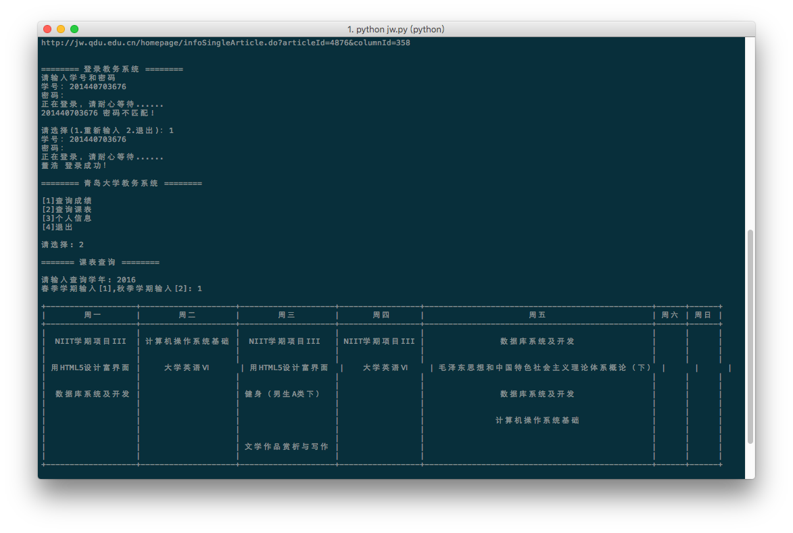

# 青岛大学教务爬虫
> Python 2.7

## 介绍
本爬虫可以查询教务通知，并且登录教务系统，进行成绩查询，课表查询等

- Pillow 图片操作
- request 登录
- lxml 内容解析
- prettytable 打印表格
- tesseract 验证码识别

## 支持
- 验证码自动识别
- 个人信息查询
- 课表查询
- 成绩查询

## 未完成
- 将课表中，课程，教师，时间等分隔开
- 查询信息更加详细（伪命题）
- 生成 json 文件
- ......

## 截图

